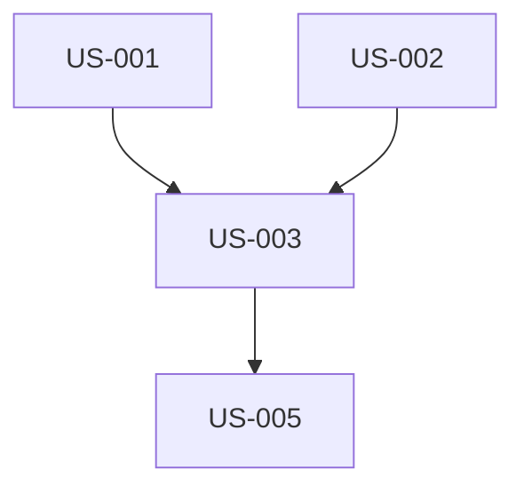

# /compose-prd Skill

Assemble a complete PRD from selected domain fragments in the saas-blueprint.

## Trigger

```
/compose-prd [domain1] [domain2] ... [domainN]
```

**Examples:**
- `/compose-prd auth database api`
- `/compose-prd auth database api ui realtime notifications`
- `/compose-prd auth` (single domain)

## Purpose

Creates a complete, Ralph-compatible PRD by:
1. Reading prd-fragment.md from each specified domain
2. Merging user stories with sequential numbering
3. Calculating combined effort estimates
4. Generating a unified PRD ready for `/ralph-convert`

## Output

Generates `./ralph/prd.md` with:
- Project overview synthesized from selected domains
- All user stories renumbered sequentially (US-001, US-002, ...)
- Combined technical considerations
- Total effort estimate

## Process

### Step 1: Validate Domains

Check that each specified domain exists in the blueprint:

```
Available domains:
- auth
- database
- api
- ui
- realtime
- notifications
- compliance
- testing
```

Report any domains not found and proceed with available ones.

### Step 2: Read PRD Fragments

For each domain, read:
```
saas-blueprint/domains/[domain]/prd-fragment.md
```

Extract:
- User stories with acceptance criteria
- Technical notes
- Effort estimates
- Dependencies between domains

### Step 3: Merge User Stories

Renumber all user stories sequentially:

```
Original:                    Merged:
US-AUTH-001 → US-001
US-AUTH-002 → US-002
US-DB-001   → US-003
US-DB-002   → US-004
US-API-001  → US-005
...
```

Preserve cross-references by updating story IDs:
- "Depends on US-AUTH-001" → "Depends on US-001"

### Step 4: Calculate Estimates

Sum the estimates from all fragments:

```
Auth Domain:      12-18 hours
Database Domain:   8-12 hours
API Domain:       18-26 hours
------------------------
Total:            38-56 hours
```

### Step 5: Generate PRD

Create `./ralph/prd.md`:

```markdown
# Project PRD

## Overview

[Synthesized from domain READMEs - 2-3 paragraphs describing the project scope]

## Domains Included

- **Auth**: [brief description]
- **Database**: [brief description]
- **API**: [brief description]

## User Stories

### US-001: [Title from auth domain]

**As a** [user type]
**I want to** [capability]
**So that** [benefit]

**Acceptance Criteria:**
- [ ] [Criterion 1]
- [ ] [Criterion 2]

**Technical Notes:**
- [Implementation hints]
- Domain: auth

**Estimated Effort:** X-Y hours

---

### US-002: [Title from auth domain]
...

[Continue for all stories]

## Technical Considerations

### Authentication
[From auth domain]

### Database
[From database domain]

### API Design
[From api domain]

## Dependencies

[Mermaid diagram showing story dependencies]



## Effort Summary

| Domain | Stories | Min Hours | Max Hours |
|--------|---------|-----------|-----------|
| Auth | 5 | 12 | 18 |
| Database | 4 | 8 | 12 |
| API | 10 | 18 | 26 |
| **Total** | **19** | **38** | **56** |

## Ready for Ralph

This PRD is ready for conversion with:
```
/ralph-convert
```

This will generate `./ralph/stories.json` for autonomous execution.
```

### Step 6: Output Summary

```
PRD Composed Successfully!

Domains: auth, database, api
User Stories: 19
Total Estimate: 38-56 hours

Output: ./ralph/prd.md

Next Steps:
1. Review the generated PRD
2. Adjust scope or estimates as needed
3. Run /ralph-convert to generate stories.json
4. Execute with ralph.sh
```

## Domain Ordering

Stories are ordered by domain in this recommended sequence:

1. **auth** - Foundation for all authenticated features
2. **database** - Data layer required by other domains
3. **api** - Server endpoints
4. **ui** - Frontend components
5. **realtime** - Real-time features
6. **notifications** - Notification system
7. **compliance** - GDPR, audit logging
8. **testing** - Test coverage

This ordering respects natural dependencies.

## Customization Options

### Selective Stories

To include only specific stories from a domain:

```
/compose-prd auth[US-AUTH-001,US-AUTH-002] database
```

### MVP Mode

To generate an MVP-focused PRD with core stories only:

```
/compose-prd --mvp auth database api
```

MVP mode selects stories tagged as "core" or "essential".

### Custom Project Name

```
/compose-prd --name "My SaaS App" auth database
```

## Quality Checks

Before generating, verify:

- [ ] All specified domains have prd-fragment.md
- [ ] User stories have acceptance criteria
- [ ] Effort estimates are present
- [ ] No circular dependencies
- [ ] Stories are appropriately sized (2-8 hours each)

## Error Handling

### Domain Not Found
```
Warning: Domain 'payments' not found in blueprint.
Available domains: auth, database, api, ui, realtime, notifications, compliance, testing
Proceeding with found domains...
```

### Missing PRD Fragment
```
Warning: domains/auth/prd-fragment.md not found.
Skipping auth domain.
```

### Invalid Story Format
```
Warning: US-AUTH-003 missing acceptance criteria.
Adding placeholder: "- [ ] Define acceptance criteria"
```

## Integration with Ralph

The generated PRD is designed to work seamlessly with Ralph:

1. **Story Sizing**: Each story is 2-8 hours (fits single Claude session)
2. **Clear AC**: Acceptance criteria enable automated verification
3. **Technical Notes**: Help Claude understand implementation approach
4. **Dependencies**: Allow Ralph to order execution correctly

After composing:
```bash
/ralph-convert         # Generates stories.json
./ralph/ralph.sh      # Starts autonomous execution
```

## Example Output

For `/compose-prd auth database`:

```markdown
# Project PRD

## Overview

This project implements a secure, multi-tenant SaaS application with
robust authentication and a scalable database layer. Users can register,
login, and manage their accounts with role-based access control. Data
is stored in Firestore with comprehensive security rules.

## Domains Included

- **Auth**: Firebase Authentication with custom claims, RBAC, session management
- **Database**: Firestore schema, security rules, CRUD operations

## User Stories

### US-001: Email/Password Authentication

**As a** new user
**I want to** register with my email and password
**So that** I can create an account and access the application

**Acceptance Criteria:**
- [ ] Registration form with email and password fields
- [ ] Password strength validation (8+ chars, mixed case, numbers)
- [ ] Email verification sent on registration
- [ ] Error handling for duplicate emails
- [ ] Redirect to dashboard after successful registration

**Technical Notes:**
- Use Firebase Auth createUserWithEmailAndPassword
- Send verification email with sendEmailVerification
- Create user document in Firestore on first login
- Domain: auth

**Estimated Effort:** 3-4 hours

---

[... more stories ...]

## Effort Summary

| Domain | Stories | Min Hours | Max Hours |
|--------|---------|-----------|-----------|
| Auth | 5 | 12 | 18 |
| Database | 4 | 8 | 12 |
| **Total** | **9** | **20** | **30** |
```

## Notes

- Always generate into `./ralph/prd.md` for consistency
- Include domain tags in technical notes for traceability
- Preserve original story IDs in comments for reference
- Consider dependencies when ordering stories
